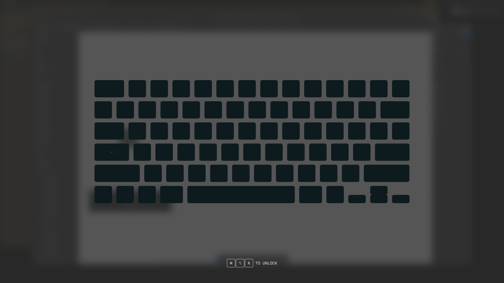
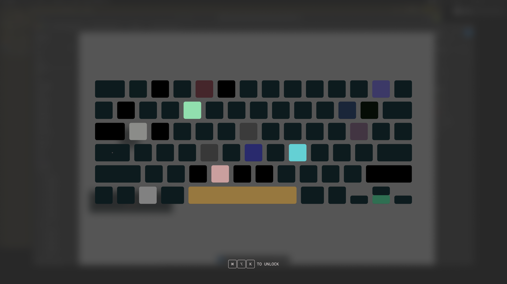

# Numb

A tiny macOS app that makes your keyboard go numb so you can clean it without mashing keys. Toddlers and cats welcome.



## What it does

- Swallows every keystroke, modifier, mouse click, scroll, and trackpad gesture the moment it launches
- Hides the cursor and blurs/dims every connected display so you know it's locked
- Renders a live on-screen Mac keyboard that scales to 75% of each screen's width
- Every stray press flashes the matching key a **random color** from a 24-hue palette, then slowly fades back over 2.5s — accidental lightshow
- Default unlock combo is **⌘ ⌥ K**; customize it in settings
- **⌘ ,** opens a native settings panel any time the app is running
- Optional **silly mode** — app refuses to unlock until every key on the on-screen keyboard has been pressed at least once

The physical power/Touch ID button isn't blocked (macOS reserves it), so you always have a way out.



## Settings

Press **⌘ ,** while Numb is running to open a native settings window:

- **Unlock shortcut** — click the shortcut button and press the chord you want (modifiers echo live as you hold them; Esc cancels). Persists across launches.
- **Silly mode** — toggle on to block unlock until every key on the on-screen keyboard (77 keys) has been pressed. The overlay shows a `MASH EVERY KEY · n/77` counter. The fingerprint/power slot is dimmed and excluded from the count.

## Install

[**Download Numb.zip**](https://github.com/ravivasavan/numb/releases/latest/download/Numb.zip) &nbsp;·&nbsp; [all releases](https://github.com/ravivasavan/numb/releases)

1. Download `Numb.zip` from the link above (or the [releases page](https://github.com/ravivasavan/numb/releases/latest)).
2. Unzip and drag `Numb.app` into `/Applications`.
3. First launch prompts for **Accessibility** access — required for the keyboard lock. Grant it in **System Settings → Privacy & Security → Accessibility**, then relaunch.

## Use

1. Open `Numb.app`
2. Screen blurs + dims, keyboard and mouse are dead
3. Clean the keyboard (or let the toddler / cat go to town)
4. Press **⌘ ⌥ K** (or your custom shortcut) to unlock

## Build from source

```sh
./build.sh
open build/Numb.app
```

Requires Xcode command-line tools (`swiftc`, `iconutil`, `sips`). The script builds the `.app` bundle, generates the icon set from `Resources/AppIcon.png`, and ad-hoc signs the result.
