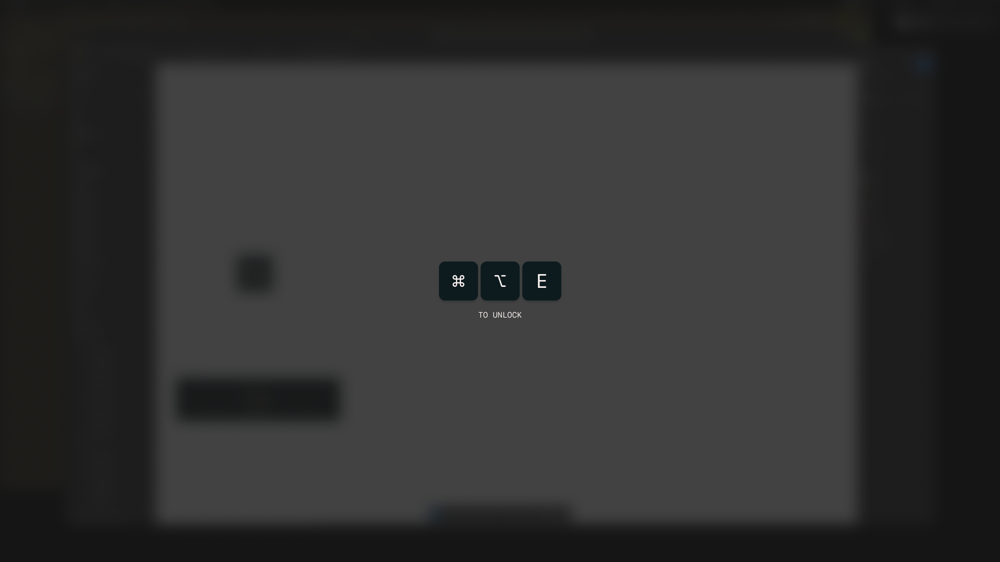

# Numb

A tiny macOS app that makes your keyboard go numb so you can clean it without mashing keys.



## What it does

- Swallows every keystroke and modifier the moment it launches
- Dims and blurs every connected display so you know it's locked
- Only **⌘ ⌥ E** quits the app and brings the keyboard back

Mouse, trackpad, and the physical power button are not blocked, so you always have a way out.

## Install

1. Download the latest `Numb.zip` from the [releases page](https://github.com/ravivasavan/numb/releases/latest).
2. Unzip it and drag `Numb.app` into `/Applications`.
3. First launch will prompt for **Accessibility** access — required for the keyboard lock. Grant it in **System Settings → Privacy & Security → Accessibility**, then relaunch.

## Use

1. Open `Numb.app`
2. Screen dims, keyboard is dead
3. Clean the keyboard
4. Press **⌘ ⌥ E** to unlock

## Build from source

```sh
./build.sh
open build/Numb.app
```

Requires Xcode command-line tools (`swiftc`, `iconutil`, `sips`). The script builds the `.app` bundle, generates the icon set from `Resources/AppIcon.png`, and ad-hoc signs the result.
